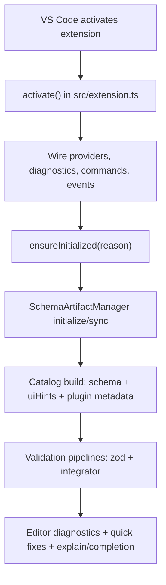
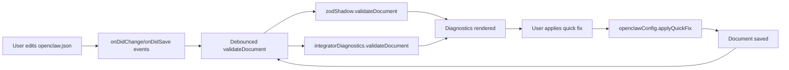

# Architecture

Goal: explain runtime behavior and module boundaries so contributors can change code safely.

## Runtime Flow (High Level)

## Module Map

### `src/extension/*` (Orchestration)

- `src/extension.ts`
  - Thin orchestrator and lifecycle wiring.
  - Owns initialization lock and startup boot logic.
- `src/extension/settings.ts`
  - Reads and normalizes all extension settings.
- `src/extension/catalog.ts`
  - Dynamic catalog cache, invalidation, plugin metadata merge trigger.
- `src/extension/events.ts`
  - Workspace/hover/config events and debounced validation scheduling.
- `src/extension/commands.ts`
  - Command handlers and user interaction flows.

### `src/schema/*` (Artifacts, Sync, Security)

- `src/schema/artifactManager.ts`
  - Live artifact sync, TTL logic, fallback, SHA-256 verification.
- `src/schema/security.ts`
  - URL policy evaluation (HTTPS, host allowlist, repository allowlist).
- `src/schema/pluginMetadata.ts`
  - Local/remote plugin hint loading and merge utilities.
- `src/schema/contentProvider.ts`
  - Content provider for `openclaw-schema://...`.
- `src/schema/dynamicSubfields.ts`, `src/schema/explain.ts`, `src/schema/types.ts`
  - Catalog building, explain payload generation, shared type contracts.

### `src/validation/*` (Diagnostics and Code Actions)

- `src/validation/zodShadow.ts`
  - Zod-based diagnostics pipeline.
- `src/validation/integratorDiagnostics.ts` + `src/validation/integratorRules.ts`
  - Cross-reference and secret hygiene checks.
- `src/validation/dedupe.ts`
  - Diagnostic deduplication and overlap filtering.
- `src/validation/codeActions/*`
  - `provider.ts`: action creation and registration.
  - `transform.ts`: quick-fix text transformation and payload application.
  - `path.ts`: path extraction and resolution helpers.
  - `types.ts`: code action payload contracts.

### `src/templating/*` (Editing Assistance)

- `src/templating/subfieldCompletion.ts`
  - Completion provider using dynamic catalog.
- `src/templating/dynamicCatalog.ts`
  - Dynamic snippet list assembly.
- `src/templating/normalize.ts`
  - Config normalization.
- `src/templating/templates.ts`
  - Starter/static template resources.

## Control/Data Flow: Edit -> Diagnose -> Fix -> Revalidate

## Initialization and Sync Model

- Initialization is guarded by a single in-flight lock (`initializePromise`).
- First initialization configures remote policy and performs initial sync.
- Sync respects `ttlHours` unless forced by explicit refresh.
- Source selection is resilient:
  1. Cache artifacts if complete and valid.
  2. Bundled artifacts fallback when sync fails or is blocked.

## Security and Trust Boundaries

- Remote manifest/artifact URLs must pass policy checks.
- Artifact contents must match expected SHA-256.
- Plugin metadata remote URL is also policy-checked.
- Unsafe policy settings can widen attack surface; documentation should steer users toward explicit allowlists.

## Contributor Notes

- Keep command IDs and settings keys stable unless intentionally versioned.
- Preserve behavior-frozen expectations when refactoring orchestration.
- Add/update docs when changing diagnostics, quick fixes, or sync behavior.

## Related Guides

- Contribution workflow: [`contributing.md`](./contributing.md)
- Operational runbook: [`runbook.md`](./runbook.md)
